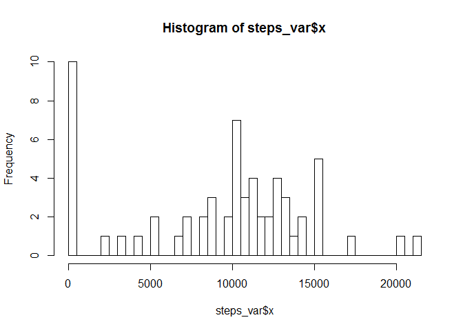
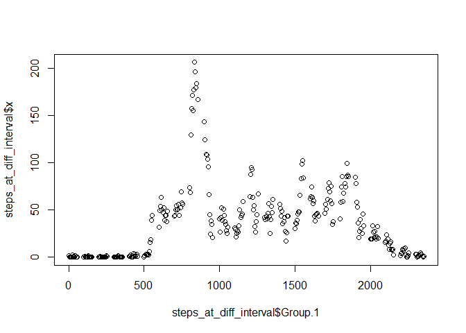

# Reproducible Research: Peer Assessment 1


## Loading and preprocessing the data

```r
activity_df <- read.csv("activity.csv")
```

## What is mean total number of steps taken per day?

```r
act_wo_na <- activity_df[!is.na(activity_df[,1]),]
days <- unique(act_wo_na$date)
no_of_days <- length(days)
sum_of_steps <- sum(act_wo_na$steps)
no_of_steps_per_day <- sum_of_steps/no_of_days
## Printing number of steps per day
no_of_steps_per_day
```

```
## [1] 10766.19
```

```r
steps_var <- aggregate(activity_df$steps,list(activity_df$date), FUN = sum, na.rm= TRUE)
hist(steps_var$x,breaks=61)
```

 

```r
mean_steps <- mean(steps_var$x)
mean_steps
```

```
## [1] 9354.23
```

```r
median_steps <- median(steps_var$x)
median_steps
```

```
## [1] 10395
```


## What is the average daily activity pattern?

```r
steps_at_diff_interval <- aggregate(activity_df$steps,
                                    list(activity_df$interval), FUN = mean, na.rm= TRUE)
plot(steps_at_diff_interval$Group.1,steps_at_diff_interval$x)
```

 

## Imputing missing values


## Are there differences in activity patterns between weekdays and weekends?
