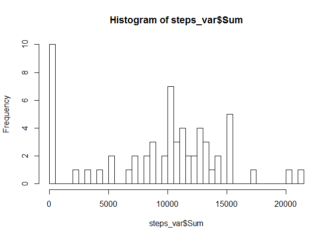

# Reproducible Research: Peer Assessment 1


## Loading and preprocessing the data

```r
activity_df <- read.csv("activity.csv")
```

## What is mean total number of steps taken per day?

```r
act_wo_na <- activity_df[!is.na(activity_df[,1]),]
days <- unique(act_wo_na$date)
no_of_days <- length(days)
sum_of_steps <- sum(act_wo_na$steps)
no_of_steps_per_day <- sum_of_steps/no_of_days
## Printing number of steps per day
no_of_steps_per_day
```

```
## [1] 10766.19
```

```r
steps_var <- setNames(aggregate(activity_df$steps,list(activity_df$date), FUN = sum, na.rm= TRUE)
                      ,c("Date","Sum"))
steps_var
```

```
##          Date   Sum
## 1  2012-10-01     0
## 2  2012-10-02   126
## 3  2012-10-03 11352
## 4  2012-10-04 12116
## 5  2012-10-05 13294
## 6  2012-10-06 15420
## 7  2012-10-07 11015
## 8  2012-10-08     0
## 9  2012-10-09 12811
## 10 2012-10-10  9900
## 11 2012-10-11 10304
## 12 2012-10-12 17382
## 13 2012-10-13 12426
## 14 2012-10-14 15098
## 15 2012-10-15 10139
## 16 2012-10-16 15084
## 17 2012-10-17 13452
## 18 2012-10-18 10056
## 19 2012-10-19 11829
## 20 2012-10-20 10395
## 21 2012-10-21  8821
## 22 2012-10-22 13460
## 23 2012-10-23  8918
## 24 2012-10-24  8355
## 25 2012-10-25  2492
## 26 2012-10-26  6778
## 27 2012-10-27 10119
## 28 2012-10-28 11458
## 29 2012-10-29  5018
## 30 2012-10-30  9819
## 31 2012-10-31 15414
## 32 2012-11-01     0
## 33 2012-11-02 10600
## 34 2012-11-03 10571
## 35 2012-11-04     0
## 36 2012-11-05 10439
## 37 2012-11-06  8334
## 38 2012-11-07 12883
## 39 2012-11-08  3219
## 40 2012-11-09     0
## 41 2012-11-10     0
## 42 2012-11-11 12608
## 43 2012-11-12 10765
## 44 2012-11-13  7336
## 45 2012-11-14     0
## 46 2012-11-15    41
## 47 2012-11-16  5441
## 48 2012-11-17 14339
## 49 2012-11-18 15110
## 50 2012-11-19  8841
## 51 2012-11-20  4472
## 52 2012-11-21 12787
## 53 2012-11-22 20427
## 54 2012-11-23 21194
## 55 2012-11-24 14478
## 56 2012-11-25 11834
## 57 2012-11-26 11162
## 58 2012-11-27 13646
## 59 2012-11-28 10183
## 60 2012-11-29  7047
## 61 2012-11-30     0
```

```r
hist(steps_var$Sum,breaks=61)
```

 

```r
mean_steps <- mean(steps_var$Sum)
mean_steps
```

```
## [1] 9354.23
```

```r
median_steps <- median(steps_var$Sum)
median_steps
```

```
## [1] 10395
```


## What is the average daily activity pattern?

```r
steps_at_diff_interval <- setNames(aggregate(activity_df$steps,
                                    list(activity_df$interval), FUN = mean, na.rm= TRUE),
                                   c("Interval","mean"))

plot(steps_at_diff_interval$Interval,steps_at_diff_interval$mean)
```

 

```r
max_steps <- max(steps_at_diff_interval$mean)
max_steps
```

```
## [1] 206.1698
```

```r
max_steps_interval <- subset(steps_at_diff_interval,mean == max_steps)[1,1]
max_steps_interval
```

```
## [1] 835
```

## Imputing missing values


```r
no_of_nas <- sum(is.na(activity_df))
no_of_nas
```

```
## [1] 2304
```

```r
activity_df_mod <- activity_df
### Inserting median for that interval to the na values
activity_df_mod$steps[is.na(activity_df_mod$steps)] <- with(activity_df_mod, ave(steps, interval, 
   FUN = function(x) median(x, na.rm = TRUE)))[is.na(activity_df_mod$steps)]


steps_var_mod <- setNames(aggregate(activity_df_mod$steps,list(activity_df_mod$date), 
                                    FUN = sum, na.rm= TRUE),c("Date","Sum"))
steps_var_mod
```

```
##          Date   Sum
## 1  2012-10-01  1141
## 2  2012-10-02   126
## 3  2012-10-03 11352
## 4  2012-10-04 12116
## 5  2012-10-05 13294
## 6  2012-10-06 15420
## 7  2012-10-07 11015
## 8  2012-10-08  1141
## 9  2012-10-09 12811
## 10 2012-10-10  9900
## 11 2012-10-11 10304
## 12 2012-10-12 17382
## 13 2012-10-13 12426
## 14 2012-10-14 15098
## 15 2012-10-15 10139
## 16 2012-10-16 15084
## 17 2012-10-17 13452
## 18 2012-10-18 10056
## 19 2012-10-19 11829
## 20 2012-10-20 10395
## 21 2012-10-21  8821
## 22 2012-10-22 13460
## 23 2012-10-23  8918
## 24 2012-10-24  8355
## 25 2012-10-25  2492
## 26 2012-10-26  6778
## 27 2012-10-27 10119
## 28 2012-10-28 11458
## 29 2012-10-29  5018
## 30 2012-10-30  9819
## 31 2012-10-31 15414
## 32 2012-11-01  1141
## 33 2012-11-02 10600
## 34 2012-11-03 10571
## 35 2012-11-04  1141
## 36 2012-11-05 10439
## 37 2012-11-06  8334
## 38 2012-11-07 12883
## 39 2012-11-08  3219
## 40 2012-11-09  1141
## 41 2012-11-10  1141
## 42 2012-11-11 12608
## 43 2012-11-12 10765
## 44 2012-11-13  7336
## 45 2012-11-14  1141
## 46 2012-11-15    41
## 47 2012-11-16  5441
## 48 2012-11-17 14339
## 49 2012-11-18 15110
## 50 2012-11-19  8841
## 51 2012-11-20  4472
## 52 2012-11-21 12787
## 53 2012-11-22 20427
## 54 2012-11-23 21194
## 55 2012-11-24 14478
## 56 2012-11-25 11834
## 57 2012-11-26 11162
## 58 2012-11-27 13646
## 59 2012-11-28 10183
## 60 2012-11-29  7047
## 61 2012-11-30  1141
```

```r
hist(steps_var_mod$Sum,breaks=61)
```

 

```r
mean_steps_mod <- mean(steps_var_mod$Sum)
mean_steps_mod
```

```
## [1] 9503.869
```

```r
median_steps_mod <- median(steps_var_mod$Sum)
median_steps_mod
```

```
## [1] 10395
```

```r
if(mean_steps_mod == mean_steps) print("Modified median is same") else print("Not equal")
```

```
## [1] "Not equal"
```

```r
if(median_steps_mod == median_steps) print("Modified median is same") else print("Not equal")
```

```
## [1] "Modified median is same"
```

```r
if(sum(steps_var_mod$Sum) > sum(steps_var$Sum) ) print("Modified sum is greater ") else print("Lesser or equal")
```

```
## [1] "Modified sum is greater "
```

## Are there differences in activity patterns between weekdays and weekends?

```r
activity_df$weekday <- weekdays(as.Date(activity_df$date))
activity_df$weekday <- replace(activity_df$weekday,activity_df$weekday=="Monday","weekday")
activity_df$weekday <- replace(activity_df$weekday,activity_df$weekday=="Tuesday","weekday")
activity_df$weekday <- replace(activity_df$weekday,activity_df$weekday=="Wednesday","weekday")
activity_df$weekday <- replace(activity_df$weekday,activity_df$weekday=="Thursday","weekday")
activity_df$weekday <- replace(activity_df$weekday,activity_df$weekday=="Friday","weekday")
activity_df$weekday <- replace(activity_df$weekday,activity_df$weekday=="Saturday","weekend")
activity_df$weekday <- replace(activity_df$weekday,activity_df$weekday=="Sunday","weekend")
activity_df$weekday <- factor(activity_df$weekday)
summary(activity_df)
```

```
##      steps                date          interval         weekday     
##  Min.   :  0.00   2012-10-01:  288   Min.   :   0.0   weekday:12960  
##  1st Qu.:  0.00   2012-10-02:  288   1st Qu.: 588.8   weekend: 4608  
##  Median :  0.00   2012-10-03:  288   Median :1177.5                  
##  Mean   : 37.38   2012-10-04:  288   Mean   :1177.5                  
##  3rd Qu.: 12.00   2012-10-05:  288   3rd Qu.:1766.2                  
##  Max.   :806.00   2012-10-06:  288   Max.   :2355.0                  
##  NA's   :2304     (Other)   :15840
```

```r
steps_at_diff_interval_mod <- setNames(aggregate(activity_df$steps,
                                    list(activity_df$interval,activity_df$weekday), 
                                    FUN = mean, na.rm= TRUE),
                                   c("Interval","type","mean"))
library(lattice)
xyplot(mean ~ Interval  | factor(type),data = steps_at_diff_interval_mod, 
       xlab="Interval",  ylab="Number of steps",layout=c(1,2),type=c("l"))
```

 
